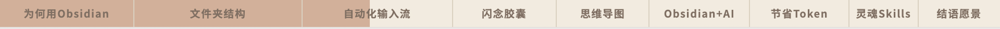

# 视频章节进度条动画 · Chapter Progress Bar v2.0

**一键为 YouTube 视频生成章节进度条动画** —— 透明背景，可直接叠加在视频上，基于 [Remotion](https://remotion.dev) 的 AI Agent Skill。

v2.0 新增 **8 种进度条风格**，默认仍为米色 Chapter 章节条。支持横屏（16:9）和竖屏（9:16）。

---

## 安装 · Installation

复制下面这句话，发给你的 AI Agent（Claude Code、Cursor、Gemini CLI 等），它会自动安装：

> **"Please install this skill: `https://github.com/serenawangCU/chapter-progress-bar`"**

就这一句，Agent 会自动克隆仓库并读取 `SKILL.md`，之后就能直接使用了。

---

## 效果预览 · Preview

默认风格：进度条横跨视频顶部，每个章节占据对应时长的宽度，已播放部分填充为暖棕色，未播放部分为浅米色。



---

## 8 种风格 · Styles

| 风格 | 说明 |
|------|------|
| **Chapter（默认）** | 米色分段条 + 章节名，顶部 |
| Chapter Bottom | 同上，条在底部 |
| Chapter Portrait | 同上，竖屏 9:16 |
| Dash | 分段破折号 + 章节名 |
| Minimal | 极简单线 + 节点圆点，无文字 |
| Text Highlight | 纯文字高亮 + `\|` 分隔 |
| Kyomi | 米色条 + **自定义 PNG 头像**沿进度移动 |
| Crab | 粉色条 + **螃蟹 SVG** 沿进度爬行 |

详细对照见 [`references/styles.md`](references/styles.md)。

---

## 功能 · Features

- **8 种视觉风格**：一键切换，默认米色 Chapter
- **自动分析字幕**：读取 `.srt` 文件，建议章节划分
- **直接输入时间戳**：无需字幕，自己指定 `2:07 章节名` 格式即可
- **透明背景**：导出 WebM 或 ProRes，直接叠加在视频上
- **定制素材**：Kyomi 支持用户上传 PNG；Crab 内置 SVG 可换配色或替换吉祥物
- **附赠 YouTube 章节格式**：同时输出可直接粘贴到视频描述的时间戳

---

## 使用方式 · How to Use

### 前置条件

- Node.js ≥ 18
- 已安装 Claude Code / Cursor 等 AI Agent

### ⚡ 快速开始

直接把下面这段复制给 Agent，填入你的信息就能用：

```
帮我做一个视频章节进度条动画。

风格：Chapter（默认）/ Dash / Minimal / Kyomi / ...
视频比例：16:9（或 9:16）
视频时长：XX 分 XX 秒
章节如下：
0:00 章节一
2:07 章节二
4:46 章节三
...
```

或者直接扔 `.srt` 字幕文件给 Agent，让它自动分析章节。

### 触发方式

**方式一**：slash command
```
/chapter-progress-bar
```

**方式二**：自然语言
```
帮我给这个视频做 Dash 风格的章节进度条
帮我做 Kyomi 进度条，头像用这个 PNG
2:07 文件夹结构
4:46 自动化输入流
```

### 流程

1. Agent 读取字幕 / 接收时间戳，确认章节划分
2. **选择进度条风格**（未指定则默认 Chapter）
3. Kyomi / Crab 按需处理定制素材
4. 创建或复用 Remotion overlay 项目，写入 `src/progress-bars/` 组件
5. 启动预览 `npm run dev`，在浏览器里查看效果
6. 用户确认后，Agent 给出渲染命令（不自动渲染）

---

## 输出格式 · Output

| 格式 | 命令 | 适用场景 |
|------|------|---------|
| WebM (VP8) | `--codec=vp8` | 通用，DaVinci / Premiere |
| ProRes 4444 | `--codec=prores --prores-profile=4444` | Final Cut Pro |

```bash
npx remotion render ChapterProgressBar --codec=vp8 out/progress-bar.webm
npx remotion render DashProgressBar --codec=vp8 out/dash-progress.webm
```

渲染完成后，在剪辑软件里把文件拖到视频轨道**最上层**即可。

---

## 项目结构 · Project Structure

```
src/
├── Root.tsx
└── progress-bars/
    ├── ChapterProgressBar.tsx        ← 默认
    ├── ChapterProgressBarBottom.tsx
    ├── ChapterProgressBarPortrait.tsx
    ├── DashProgressBar.tsx
    ├── MinimalProgressBar.tsx
    ├── TextHighlightProgressBar.tsx
    ├── KyomiProgressBar.tsx
    ├── CrabProgressBar.tsx
    └── assets/
        └── kyomi_smile_head_stroke.png
```

---

## 作者 · Author

Made by [心心 Serena](https://www.youtube.com/@serena_xinxin) · [用AI发电社群](https://pathunfold.com/serena)
